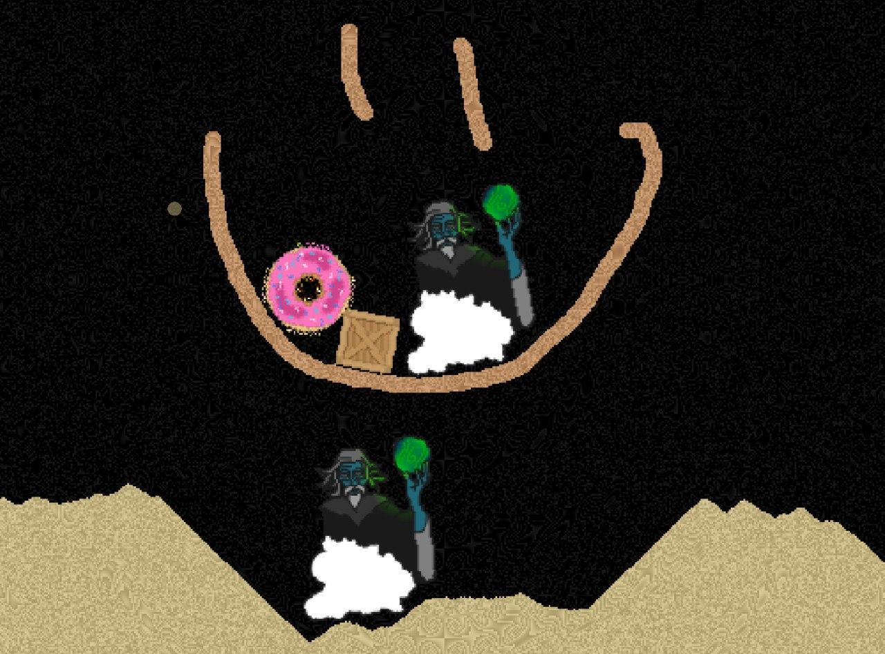

# Sandbox


Sandbox is a pixel physics simulator inspired by other such like [Sandspiel](https://github.com/MaxBittker/sandspiel).
It's also an exploration project towards creating a pixel physics game similar to [Noita](https://noitagame.com/).
I'm planning to take learnings from this project while working towards a more usable world building & game editor.
Sandbox is written in Rust.




## Features
- Vulkan renderer with [Vulkano](https://github.com/vulkano-rs/vulkano)
- Gui with [Egui](https://github.com/emilk/egui) using [egui_winit_vulkano](https://github.com/hakolao/egui_winit_vulkano)
- Cellular Automata simulation with Compute Shaders (Why? To see if I can)
- Deformable pixel objects with Matter from `.png` images
- Customizable matters & their reactions
- Physics using [Rapier](https://rapier.rs/)
- More

## Installation
Ensure following libs are installed:

### Windows
`cmake`, `ninja`, `python` 

### Ubuntu
```
sudo apt-get install build-essential git python cmake libvulkan-dev vulkan-utils libxcb-render0-dev libxcb-shape0-dev libxcb-xfixes0-dev
```

### MacOS
See [MacOS installation](https://github.com/vulkano-rs/vulkano). Basically you need Vulkan SDK on mac and it should then work out of the box.

## Running
```sh
cargo run --package sandbox --release
```
