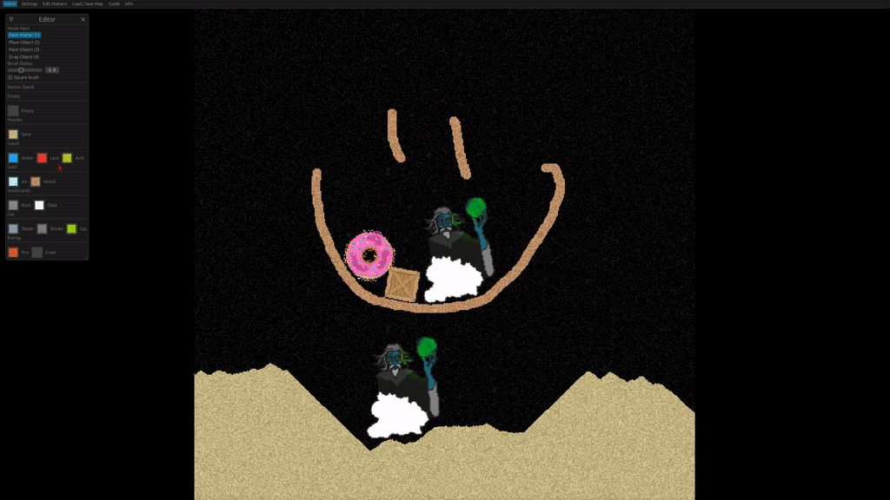

# Sandbox


Sandbox is a pixel physics simulator inspired by other such like [Sandspiel](https://github.com/MaxBittker/sandspiel) and [Noita](https://noitagame.com/).
It's also a precursor for an ongoing game project. Sandbox is written in Rust.



## Download for MacOS, Windows and Ubuntu

Download from [Releases](https://github.com/hakolao/sandbox/releases).
MacOS release build still requires VulkanSDK to be installed and libs found in `/usr/local/lib`. Linux and Windows should work as is.

## Features

- Vulkan renderer with [Vulkano](https://github.com/vulkano-rs/vulkano)
- Gui with [Egui](https://github.com/emilk/egui) using [egui_winit_vulkano](https://github.com/hakolao/egui_winit_vulkano)
- Cellular Automata simulation with Compute Shaders (Why? To see if I can)
- Deformable pixel objects with Matter from `.png` images
- Customizable matters & their reactions
- Simple physics using [Rapier](https://rapier.rs/)
- More

## Installation

### Windows

Ensure following libs are installed: `cmake`, `ninja`, `python`

### Ubuntu

```
sudo apt-get install build-essential git python cmake libvulkan-dev vulkan-utils libxcb-render0-dev libxcb-shape0-dev libxcb-xfixes0-dev
```

### MacOS

See [MacOS installation](https://github.com/vulkano-rs/vulkano). Basically you need Vulkan SDK on mac and it should then work out of the box.

## Running

```sh
cargo run --package sandbox --release
```

# Building Releases on Ubuntu

Run `sudo ./osxcross_setup.sh`.
